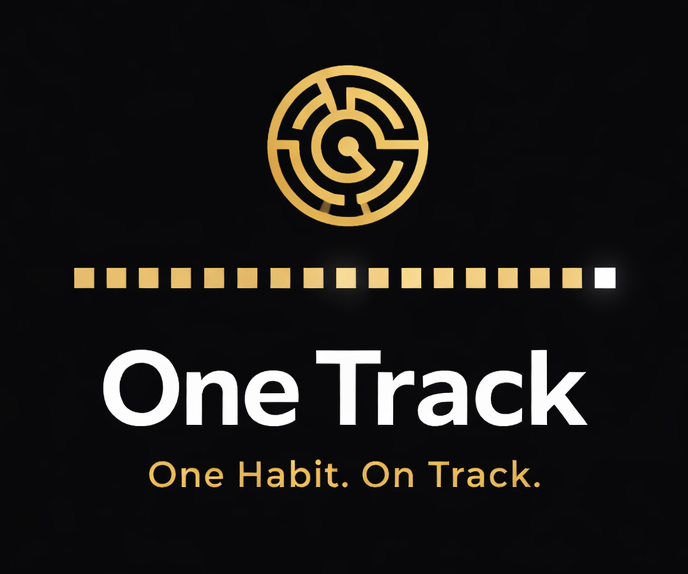
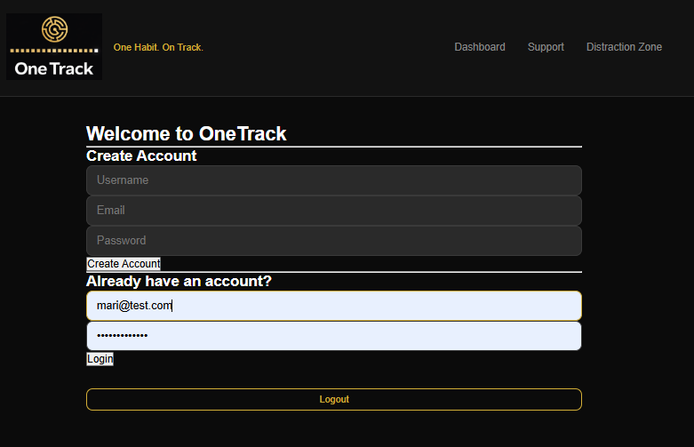
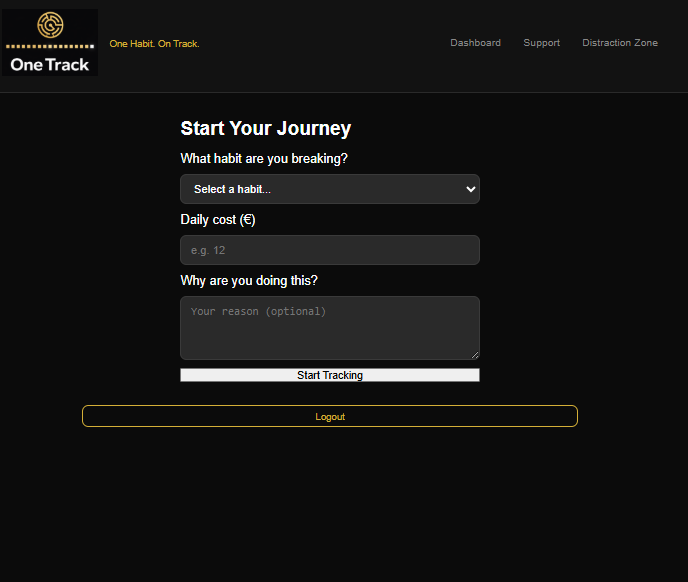
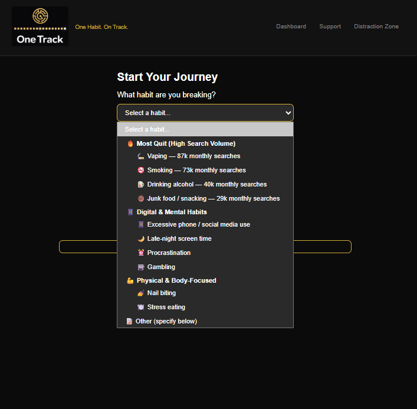
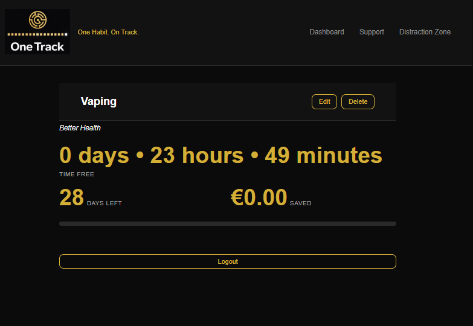
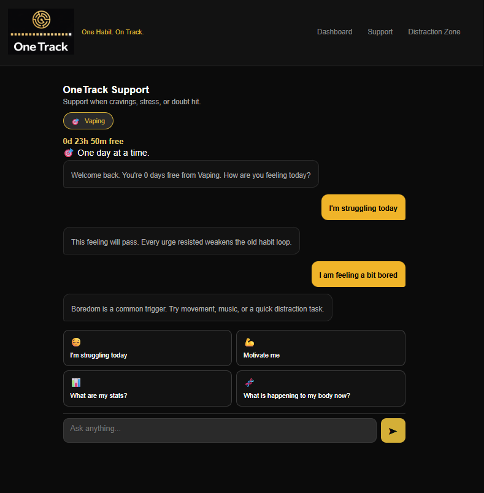
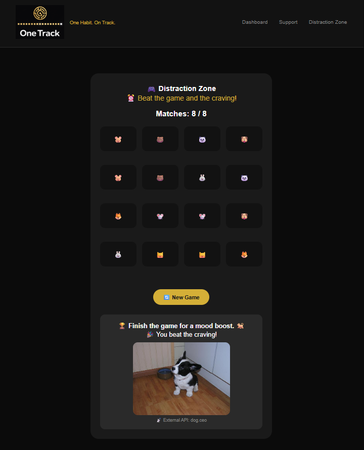
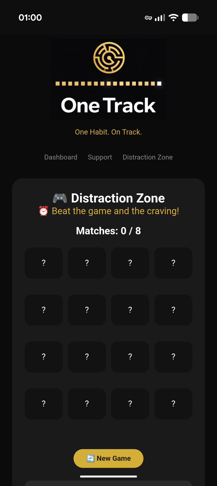

# OneTrack App

> *One Habit. On Track.*



**Module:** Web Services & Applications  
**Programme:** HDip in Computing in Data Analytics  
**Institution:** ATU Galway-Mayo  

---

## 📖 Table of Contents

1. [Introduction](#1-introduction)
2. [The Brand](#2-the-brand)
3. [The Science](#3-the-scientific-background)
4. [Features](#4-features)
5. [Tech Stack](#5-tech-stack)
6. [File Descriptions](#6-file-descriptions)
7. [How to Run](#7-how-to-run)
8. [Future Features](#8-future-features)
9. [References](#9-references)

---

## 1. Introduction

OneTrack is a habit-breaking web application built with Flask, SQLite, and JavaScript. Unlike traditional habit trackers that can overwhelm users with multiple metrics, OneTrack strips away the noise — allowing users to focus on breaking **one habit at a time**, over a focused **28-day window**.

The app was built as the main project submission for the Web Services & Applications module at ATU Galway-Mayo. It demonstrates a functional RESTful API with CRUD operations across multiple database tables, connected to a frontend via JavaScript (AJAX).

---

## 2. About OneTrack App

### 2.1 Rationale

While most habit tracking apps try to do everything — they track sleep, steps, water intake, screen time, achieving world peace and 367 other things simultaneously. The result is an overwhelming dashboard that becomes another habit changing app to feel guilty about.

OneTrack was built on a different premise: **less is more powerful.**

The core idea came from personal experience using habit-tracking tools when I quit smoking. What actually worked was a single, visible commitment with a clear end date. OneTrack replicates that clarity for anyone breaking any habit — whether it's vaping, social media overuse, or stress eating.

The app does not let you add a second bad habit to quit until you have completed 28 days on your first one. That constraint is the main intention, you need to commit that you will stick with it.

> It is not a limitation — it is the product.

Source: https://lighthousebhsolutions.com/the-first-30-days-of-recovery-what-happens-and-how-to-prepare/ 

Source: https://www.victoriasincredibleedibles.ie/blog/28-days-to-a-new-you-making-or-breaking-habits

Source: https://www.worklifepsych.com/why-cant-i-stick-to-my-new-habits/

Source: https://www.helpguide.org/mental-health/wellbeing/how-to-break-bad-habits-and-change-negative-behaviors

### 2.2 Name & Visual Identity

| Element | Choice | Rationale |
|---------|--------|-----------|
| **Name** | OneTrack | Double meaning: *One Track* (single focus) + *On Track* (making progress) |
| **Colour Palette** | Black & Gold | Authority, discipline, reward |
| **Logo** | Maze | The journey out of a bad habit is rarely straight, but there is always a way |
| **Typography** | Clean, minimal | Reduces cognitive load and keeps user focused |

**Colour Palette (Black & Gold):**

Source: https://mailchimp.com/resources/color-psychology/ (Colour Psychology in Branding)

Source: https://www.colorpsychology.org/blog/color-of-justice-the-psychology-of-black-in-authority-and-power/ (Psychology of Black — Authority and Power)

Source: https://pratibodh.org/index.php/pratibodh/article/view/154/165 (Colour Psychology in UX/UI Design)

**Logo (Maze):**

Source: https://symbolixe.com/maze-symbolism/ (Maze Symbolism)

Source: https://symbolopedia.com/maze-symbolism-meaning/ (Maze Symbolism and Meaning)

**Typography (Clean, Minimal):**

Source: https://618media.com/en/blog/why-minimalist-typography-is-still-trending/ (Minimalist Typography and UX)

Source: https://uitop.design/blog/design/minimalist-ux/ (Minimalist UX Design Principles)

### 2.3 Tagline

> *One Habit. On Track.*

Short, memorable and a play with the application name.

---

### 2.4 Screenshots

**Authentication**



**New Habit**



**New Habit Menu**



**Dashboard**



**Support**



**Distraction Zone**



**Mobile**




## 3. Product Research

### 3.1 The 28-Day Rule

For many years, there were popular claims that new habits (or habit breaks) could be done in 21 days. However, this myth was recently busted, as researchers found that for new behaviour to become routine (automaticity) — took anywhere from 18 to 254 days, with a median of **66 days**.

So, why does OneTrack use 28 days, rather than 66 or even 21?

The 28-day window is a **meaningful first threshold**, not the finish line. And for most habits, the consistency of 28 days or 4 weeks, indicates you'll be more likely to:

- Break the physical dependency cycle for most (non-opioid) substances
- Rewire the immediate habitual trigger-response loop
- Build enough evidence of change to sustain motivation

> Completing 28 days is not the full finishing line. But it is the point that the user shows commitment to earn the right to begin a new habit break.

Source: https://www.theguardian.com/lifeandstyle/2009/oct/10/change-your-life-habit-28-day-rule (28-Day Habit Rule)

Source: https://pubmed.ncbi.nlm.nih.gov/35690891/ (Habit Formation Research)

Source: https://www.facebook.com/watch/?v=1082379843295875 (Habit Formation Video)

Source: https://www.citizensinformation.ie/en/health/health-services/addiction-treatment-services/drug-alcohol-addiction-services/ (Drug & Alcohol Addiction Services)

Source: https://lighthousebhsolutions.com/the-first-30-days-of-recovery-what-happens-and-how-to-prepare/ (First 30 Days of Recovery)

Source: https://www.victoriasincredibleedibles.ie/blog/28-days-to-a-new-you-making-or-breaking-habits (28 Days to a New You)


### 3.2 One Habit at a Time

The decision to restrict users to one active habit at a time is grounded on cognitive load and self-regulation research . Studies suggest that willpower operates as a finite resource; when attempting multiple behavioural changes simultaneously, people rely on this limited amount of self-control, increasing the chances of failure to competing goals.

Focusing on a single habit reduces decision fatigue, improves consistency, and increases the likelihood that behavioural change will become sustainable over time.

**OneTrack intentionally enforces a one-habit-at-a-time approach**, removing the burden of overcommitting from the user and guiding them toward a more focused and achievable path to change.

Source: https://www.worklifepsych.com/why-cant-i-stick-to-my-new-habits/ (Habit Consistency & Cognitive Load)

Source: https://www.helpguide.org/mental-health/wellbeing/how-to-break-bad-habits-and-change-negative-behaviors (Breaking Bad Habits)


### 3.3 Behavioural Principles Used in the App

| Principle | Application in App |
|-----------|---------------------|
| Habit Loop Theory (Cue-Routine-Reward) | Awareness of triggers and behavioural patterns|
| Identity-Based Habit Formation | Framing progress as part of personal change and commitment |
| Small Wins Theory | Daily progress tracking and visual feedback |
| Positive Reinforcement | Streak tracking and milestone encouragement |
| Loss Aversion | Money saved calculator reinforces value of quitting (in time or money) |

**Habit Loop Theory (Cue-Routine-Reward):**

Source: https://thedecisionlab.com/reference-guide/psychology/car-model (Cue-Action-Reward Model)

Source: https://www.tougherminds.co.uk/2024/08/27/understanding-the-habit-loop-cue-routine-reward/ (Understanding the Habit Loop)


**Identity-Based Habit Formation:**

Source: https://jamesclear.com/identity-based-habits (Identity-Based Habits — James Clear)


**Small Wins Theory:**

Source: https://icap2018.com/small-wins-momentum-psychology/ (Small Wins & Psychological Momentum)

Source: https://youngvibrant.wordpress.com/2025/01/24/the-psychology-of-small-wins/ (Psychology of Small Wins)


**Positive Reinforcement Through Streaks:**

Source: https://uxmag.medium.com/the-psychology-of-hot-streak-game-design-how-to-keep-players-coming-back-every-day-without-shame-3dde153f239c (Psychology of Streaks in Design)


**Loss Aversion Through Money Saved Tracking:**

Source: https://www.behavioraleconomics.com/resources/mini-encyclopedia-of-be/loss-aversion/ (Loss Aversion — Behavioural Economics)

Source: https://thedecisionlab.com/biases/loss-aversion (Loss Aversion — The Decision Lab)

---

## 4. Features

### 4.1 Current Features

- **Single active habit tracking** — enforced at both application and database level
- **28-day progress tracking** — displays days elapsed, days remaining, and a visual progress bar
- **Money saved calculator** — calculated from the user’s daily cost input and updated in real time
- **User authentication** — account registration, login, logout, and session handling
- **Full CRUD via REST API** — all data operations handled through AJAX calls to Flask endpoints
- **Two-state dashboard** — displays a creation form when no habit is active, and a full progress dashboard when one is active

### 4.2 User Journey

1. User creates an account or logs into an existing account
2. User selects a habit to quit (or specifies a custom habit)
3. Sets an estimated daily cost associated with the habit (e.g., money spent on smoking or time lost to excessive screen use)
4. Provides a personal reason for quitting
5. Tracks daily progress through the dashboard
6. Views time elapsed, days remaining, and money saved
7. Accesses the Support and Distraction Zone features during cravings or difficult moments
8. After completing 28 days, the user can begin tracking a new habit

---

## 5. Tech Stack

| Layer | Technology |
|-------|------------|
| Backend | Python 3.11, Flask |
| Database | SQLite 3 |
| Data Access Layer | Custom DAO pattern (`onetrack_dao.py`) |
| Frontend | HTML, CSS, JavaScript (ES6) |
| API Architecture | REST-style Flask API (GET, POST, PUT, DELETE) |
| Authentication | Flask sessions |
| CORS | Flask-CORS |
| Dev Environment | GitHub Codespaces |
| Deployment | PythonAnywhere |
---

## 6. File Descriptions

### 6.1 Python Files

#### `onetrack_server.py`
The Flask application entry point. Defines all API routes and maps them to DAO functions. CORS is enabled to allow requests from the frontend. Handles request validation and returns structured JSON responses with appropriate HTTP status codes.

**Endpoints:**

| Method | Route | Description |
|---|---|---|
| POST | `/api/user` | Register a new user |
| GET | `/api/habit?user_id=` | Get the active habit  |
| POST | `/api/habit` | Create a new habit |
| PUT | `/api/habit/<id>` | Update habit name, cost, or reason |
| DELETE | `/api/habit/<id>` | Delete a habit |

#### `onetrack_dao.py`
The Data Access Object layer. All direct SQLite interactions are handled here — no SQL lives in the server file. Includes guard logic (e.g. the 28-day check before allowing a new habit, duplicate claim/achieve prevention) and returns clean dictionaries to the server layer.

#### `onetrack_database.py`
Creates the SQLite database and all tables if they do not exist. Run this once before starting the server. Includes a unique partial index to enforce the one-active-habit-per-user rule at the database level.

### 6.2 Frontend Files

#### `index.html` (Dashboard)
The main page. Handles two states: a habit creation form when no habit is active, and a full progress dashboard when one is. Displays days elapsed, days remaining, money saved and a progress bar — all populated dynamically via AJAX.

#### `support.html`
Support chat interface providing encouragement, coping prompts, and motivational feedback.

#### `static/js/app.js`
All AJAX functions — one per API endpoint. Each function handles the fetch call, sets headers, checks the response status, and throws meaningful errors. This file has no DOM logic; it is purely the API communication layer.

#### `static/js/dashboard.js`
All DOM logic for `index.html`. Wires event listeners to forms and buttons, calls functions from `app.js`, and renders habit data into the page.

#### `static/css/style.css`
Global styles. Black and gold colour scheme, card-based layout, progress bar, responsive design.

#### `requirements.txt`
Lists Python dependencies required to run the Flask backend.

---

## 7. How to Run

### Pre-requisites

Ensure the following are installed:

```bash
pip install -r requirements.txt
```

### Steps

## 1. Clone the Repository

Download the project from GitHub:

```bash
git clone https://github.com/marianemcgrath/one-track-app.git
cd one-track-app
```

## 2. Create the Database

Run the database setup script:

```bash
python onetrack_database.py
```

*Expected output:*

```text
✅ Database upgraded successfully!
```

## 3. Start the Flask Server

```bash
python onetrack_server.py
```

This application will typically run at:

http://127.0.0.1:5000

---

**4. Open the frontend**

Open `index.html` in your browser, or visit the live deployment at:

`https://marirmcgrath.pythonanywhere.com/`

---

# 8. Future Features

OneTrack works best when it stays simple and focused and there are a few things that could make it even better:

1. Push notifications - Gentle reminders and milestone alerts to help the user stay on track throughout the 28 days. 

2. Achievements - Small rewards for hitting 7 days, 14 days, or finishing the full 28 days.

3. Cloud sync - A future version could save data to the cloud instead of locally — so the user can log in from anywhere
and continue to follow their progress.

4. Deeper stats - Seeing longest streak, how much money was saved over time, relapse patterns, and past habits.

5. Smarter coach - The Support section could offer more personal encouragement to users.

6. Accessibility - Improvements like keyboard navigation, screen-reader support and better colour contrast.

7. More distraction tools - More mini-games, breathing exercises, grounding techniques.


# 9. References

### GitHub Repositories (Research)

https://github.com/ErinNordquist/habit-tracker (Habit Tracker)

https://github.com/iSoron/uhabits (UHabits)

### Technical Documentation

https://flask.palletsprojects.com/en/stable/ (Flask Documentation)

https://requests.readthedocs.io/en/latest/ (Requests Official Documentation)

https://dev.mysql.com/doc/refman/8.0/en/ (MySQL Official Documentation)

https://developer.mozilla.org/en-US/docs/Web/JavaScript/Reference (JavaScript)


### Tutorials & Resources

Course Module - Web Services and Applications by Lecturer Andrew Beatty

https://www.youtube.com/watch?v=z3YMz-Gocmw (Python REST API Tutorial for Beginners)

https://www.youtube.com/watch?v=Bx_jHawKn5A (Easy Flask App Deployment with PythonAnywhere)

https://www.youtube.com/watch?v=TjjKcgtlsY8 (JavaScript Speed Course)

### AI Assistance

During development, AI tools (including ChatGPT, DeepSeek, and Claude AI) were used for support in areas such as:

•	Debugging Flask, SQLite, session management, and deployment issues

•	Refining frontend layout, responsive design, and CSS styling

•	Explaining JavaScript, AJAX, and API integration concepts

•	Improving project documentation, structure, and README formatting

•	Generating example test scenarios and assisting with code cleanup

All AI-assisted code and suggestions were reviewed, tested, modified where necessary, and integrated by the author.

Final implementation decisions, debugging, validation, and project integration were completed independently by the author.

**Examples include:**

https://chatgpt.com/s/t_6a05151a512c81918b03f945b4b62cb1 (Research for App)

https://chatgpt.com/s/t_6a0517ce21fc8191a13c39d3249d1a55 (First design feedback, after sending first draft repo link)

https://chatgpt.com/s/t_6a05151a512c81918b03f945b4b62cb1 (GDPR and user login)

https://chatgpt.com/s/t_6a051a419f948191b2f44067d49edc4c (Creating login)

https://chatgpt.com/s/t_6a05178e67e08191ab38d54237fd0f7f (Debugging the Support Tool)

https://chatgpt.com/s/t_6a051b69cb788191a889cbd986cbe2ed (Requesting assistance with Server Connection issues)

https://chat.deepseek.com/share/61x486gabhqdcep9ao (PythonAnywhere errors)


---
